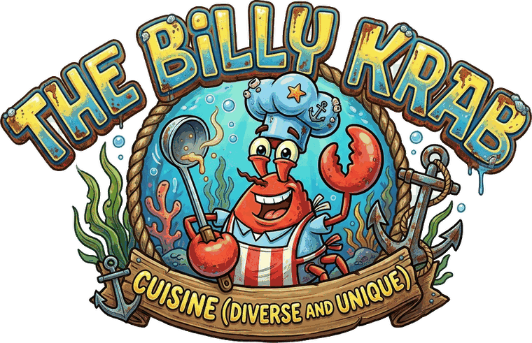

# The Billy Krab — 365-Day Food & Drink Tracker

Log what you eat and drink for a year. For reasons nobody at head office has
been able to explain, every completed daily log makes an underwater restaurant
called The Billy Krab measurably more successful — and every third completed
day the chef hands over one of 122 real recipes.

It is a genuine food diary wearing a restaurant-management costume.



---

## What it does

- **Daily logging** across six meal slots (breakfast, morning snack, lunch,
  afternoon snack, dinner, late-night snack) plus a separate drinks section
  with quantity and units. Add, edit, delete, and revisit any past day.
- **365-day progress** with a streak counter, completion percentage, and a
  tile-per-day rota you can click into.
- **Five restaurant indicators** — customers per day, fans, popularity, net
  income, branches — that compound on every filed log and are charted on a log
  scale from day 0 to day 365.
- **122 recipes** across eight cuisines, unlocked three days at a time,
  arranged as a journey from Africa to Indonesia.
- **14 achievements**, an unlock ceremony with confetti, and a day-365 finale
  that drops the last two recipes at once.
- **Persistent local storage** with JSON backup and restore. No account, no
  server, nothing leaves the browser.
- **Background music** — *The Rake Hornpipe* — off by default, one tap to start.

---

## Running it

```bash
npm install
npm run dev        # http://localhost:5173
```

Other scripts:

| Command | What it does |
|---|---|
| `npm run dev` | Development server with hot reload |
| `npm run build` | Type-check, then build to `dist/` |
| `npm run preview` | Serve the production build locally |
| `npm run typecheck` | TypeScript only, no build |
| `npm run import:recipes` | Regenerate `src/data/recipes.json` from the Markdown |

---

## Deploying

`vite.config.ts` sets `base: './'`, so the build works from any path — a
GitHub Pages project site, a Netlify drop, an S3 bucket, or a folder on disk.

**GitHub Pages.** Push to `main`, then open **Settings → Pages** and set
*Source* to **GitHub Actions**. The included workflow at
`.github/workflows/deploy.yml` builds and publishes on every push.

**Anywhere else.** Run `npm run build` and upload `dist/`.

---

## How the numbers work

Two systems drive everything, and both are deliberately simple enough to audit.

### Recipe unlocks

There are 365 days and 122 recipes, and the day-365 reward is two recipes at
once. That constrains the schedule exactly:

```
scheduled = min(floor(completedDays / 3), 120)
finale    = completedDays >= 365 ? 2 : 0
unlocked  = scheduled + finale
```

One recipe every three completed days gets you to 120 by day 360. Days 361–364
hand over nothing — that gap is the reason the finale lands cleanly on 122
rather than overshooting to 123.

Unlocks are **one-way**. Reopening a completed day to fix a typo never claws a
recipe back off the shelf, and `completeDay()` refuses to run twice on the same
day, so refreshing the page cannot pay out twice.

### Restaurant growth

Reach compounds at exactly **1% per completed log**. Branch count and customers
per branch both ride that curve, so the two headline figures compound against
themselves. Profit per customer is fixed at $10 and has never been adjusted for
inflation. About a third of everyone served becomes a permanent fan.

```
reach      = 1.01 ^ completedDays
branches   = reach ^ 1.5
customers  = 10 × reach × branches
income     = customers × $10
popularity = min(99.9%, reach ^ 1.26)
fans       = 25 + 0.35 × (every customer ever served)
```

Which produces:

| Day | Customers/day | Fans | Popularity | Net income/day | Branches |
|---:|---:|---:|---:|---:|---:|
| 0 | 10 | 25 | 1.00% | $100 | 1 |
| 30 | 21 | 183 | 1.46% | $211 | 2 |
| 90 | 94 | 1,219 | 3.09% | $938 | 4 |
| 182 | 925 | 13,062 | 9.79% | $9,252 | 15 |
| 270 | 8,259 | 117,537 | 29.5% | $82,590 | 56 |
| 365 | 87,751 | 1,249,953 | 97.1% | $877,513 | 232 |

The curve is nearly flat for six months and then goes vertical. That is what
compounding looks like, and it is why the charts use a log scale.

---

## The recipe import system

Recipes are **not** hard-coded. `scripts/import-recipes.mjs` reads the source
cookbook in `content/recipes/` and writes `src/data/recipes.json`.

For each recipe it extracts the title, the description, serves/prep/cook, the
grouped ingredient list, the numbered method, and the cook's note — all
verbatim from the Markdown. It then:

1. Matches a photograph by slug, then by an override table for the awkward
   cases (`Pizza Napoletana` → `neapolitan-pizza`), then by fuzzy token overlap.
2. Renames the file to an ASCII slug so URLs survive any static host.
3. Assigns `unlockOrder` from the journey sequence in `SECTIONS`.
4. Derives a difficulty band from real signals — total time, ingredient count,
   step count — rather than guessing.

Re-running it is idempotent. To add or edit a recipe, edit the Markdown, drop
the photo in `public/recipes/`, and run `npm run import:recipes`.

```ts
interface Recipe {
  id: number;
  unlockOrder: number;
  slug: string;
  title: string;
  cuisine: string;
  country: string;
  continent: string;
  region: string;
  coords: [number, number];
  image: string;
  description: string;
  yield: string;
  prep: string;
  cook: string;
  difficulty: 'Deckhand' | 'Line Cook' | 'Head Chef' | 'Kraken';
  ingredientGroups: { group: string; items: string[] }[];
  method: string[];
  cooksNote: string;
}
```

---

## The journey

| # | Cuisine | Recipes | Unlocks across |
|---:|---|---:|---|
| 1 | African | 15 | days 3–45 |
| 2 | Arabian Peninsula & Levant | 15 | days 48–90 |
| 3 | Latin & North American | 17 | days 93–141 |
| 4 | Italian | 15 | days 144–186 |
| 5 | French | 15 | days 189–231 |
| 6 | Japanese | 15 | days 234–276 |
| 7 | Thai | 15 | days 279–321 |
| 8 | Indonesian | 15 | days 324–360, then 365 |

**122 recipes.** The last two Indonesian dishes arrive together on day 365.

---

## Project layout

```
content/recipes/      Source cookbook, eight Markdown files
scripts/              The recipe importer
public/
  recipes/            122 photographs, ASCII slug filenames
  audio/              Background music
  billy-krab-*.png    Logo, icon, mascot
src/
  lib/
    empire.ts         Growth model and unlock schedule
    storage.ts        Local storage, dates, save import/export
    achievements.ts   Achievement definitions and stat computation
    store.tsx         App state and the one place rewards are granted
    voice.ts          All the restaurant's dialogue, in one file
    types.ts          Domain types
  components/         Ocean, Ticker, Confetti, Ceremony, MusicPlayer
  pages/              Home, DailyLog, Empire, Recipes, Journey, Calendar,
                      Achievements, Onboarding
```

---

## Design notes

The palette is pulled from the restaurant's own sign: crab-shell red
(`#E8452B`), brass (`#F7CE3E`), turquoise (`#3FBEDD`) and deep water
(`#041B29`). Type is **Bungee** for signage, **Nunito** for reading, and **IBM
Plex Mono** for anything that belongs in a ledger. Fonts load from Google
Fonts; if that's blocked the stack falls back to system faces and the layout
holds.

Panels come in two materials: laminated menu boards floating in the water, and
parchment for anything the restaurant itself is telling you. Ambient bubbles
drift behind everything and stop entirely under `prefers-reduced-motion`.

Accessibility: keyboard focus is visible throughout, charts and the route map
carry text alternatives, the calendar exposes each day's status to screen
readers, and colour is never the only signal.

---

## Data and privacy

Everything lives in this browser's `localStorage` under one key. There is no
account, no analytics, and no network request except the font stylesheet.
Clearing site data erases a year of logs, so take a backup from **Plaque wall →
Download backup** before switching device.

---

## Licence

Source code is MIT — see [LICENSE](LICENSE). The recipe text, photographs,
logo, mascot artwork and audio are supplied by the project owner and are **not**
covered by it.
